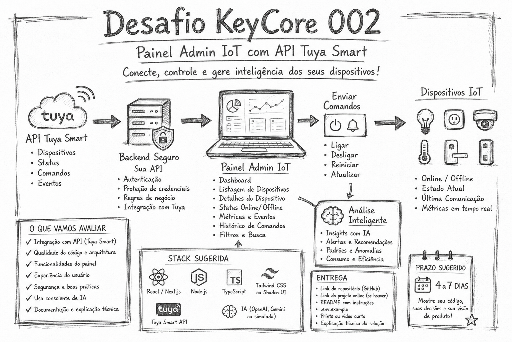

<p align="center">
  <picture>
    <source media="(prefers-color-scheme: dark)" srcset="assets/logo-keycore-dark.png">
    <source media="(prefers-color-scheme: light)" srcset="assets/logo-keycore-light.png">
    
  </picture>
</p>

<p align="center">
  
</p>

# 🚀 KeyCore Tech Challenge 02
## Dispositivos IoT → API Tuya → Painel Admin → Inteligência

Bem-vindo ao segundo desafio técnico da KeyCore.

Queremos ver como você transforma integração, automação e Internet das Coisas em um painel funcional, inteligente e útil para uma operação real.

---

# 🎯 O Desafio

Construa uma aplicação que:

1. Integre, ou simule de forma bem estruturada, uma conexão com a API da Tuya Smart  
2. Liste dispositivos IoT conectados  
3. Consulte detalhes de cada dispositivo  
4. Exiba status online/offline  
5. Exiba estado atual do equipamento  
6. Permita enviar comandos simples, como ligar/desligar  
7. Armazene ou registre histórico de comandos/eventos  
8. Crie um painel admin para monitoramento dos equipamentos  
9. Gere uma área de análise inteligente com insights sobre os dispositivos  
10. Explique claramente o que foi feito, por que foi feito e como evoluiria para produção  

O sistema deve permitir que um operador visualize, consulte e controle dispositivos IoT por meio de uma interface web.

---

# 🧠 O Problema Real

Empresas estão cada vez mais conectando dispositivos físicos à internet.

Lâmpadas, tomadas, sensores, câmeras, controladores de acesso, aparelhos de climatização e equipamentos inteligentes geram dados e podem receber comandos remotamente.

O problema é transformar esses dispositivos em uma operação organizada:

- O que está online?  
- O que está offline?  
- O que está ligado?  
- O que está consumindo energia?  
- O que precisa de atenção?  
- O que pode ser automatizado?  
- Como a IA pode ajudar a interpretar esse cenário?  

O objetivo é transformar dispositivos IoT em inteligência operacional.

---

# 🏗 Requisitos Funcionais

## 1. Integração com Tuya Smart

A aplicação deve possuir uma camada de integração com a Tuya Smart.

Essa integração pode ser real ou simulada.

Se for real, utilize a API da Tuya Smart.

Se for simulada, deixe a estrutura preparada como se fosse consumir a API real.

A aplicação deve considerar operações como:

- Buscar lista de dispositivos  
- Buscar detalhes de um dispositivo  
- Buscar status atual  
- Enviar comando para dispositivo  
- Registrar resposta da operação  

Exemplo de fluxo esperado:

```txt
Front-end
  chama
API interna do projeto
  chama
Tuya Smart Cloud API
  retorna dados
Painel atualiza a interface
```

Importante: não exponha credenciais da Tuya diretamente no front-end.

Use variáveis de ambiente e uma camada backend/intermediária.

---

## 2. Painel Admin

Crie um painel administrativo para visualização dos dispositivos.

O painel deve conter indicadores como:

- Total de dispositivos  
- Dispositivos online  
- Dispositivos offline  
- Dispositivos ligados  
- Dispositivos com possível falha  
- Última atualização  

A interface deve ser simples, clara e funcional.

Não precisa ser perfeita, mas precisa ser usável.

---

## 3. Listagem de Dispositivos

A aplicação deve listar os equipamentos IoT.

Cada equipamento deve exibir:

- Nome  
- ID do dispositivo  
- Tipo ou categoria  
- Localização  
- Status online/offline  
- Estado atual  
- Última comunicação  
- Ações disponíveis  

Exemplo:

```json
{
  "id": "dev_001",
  "name": "Lâmpada Sala 01",
  "type": "smart_light",
  "location": "Sala de Reunião",
  "connectionStatus": "online",
  "currentState": "on",
  "lastSeen": "2026-07-01T18:30:00"
}
```

---

## 4. Detalhes do Dispositivo

Ao clicar em um dispositivo, exiba uma tela, página ou modal com mais informações.

Deve conter:

- Nome  
- ID  
- Tipo  
- Localização  
- Status  
- Estado atual  
- Última comunicação  
- Métricas disponíveis  
- Histórico de eventos  
- Histórico de comandos  

Exemplo de métricas:

```json
{
  "temperature": 24.5,
  "humidity": 60,
  "energyConsumption": 12.8,
  "signalStrength": -62
}
```

Nem todos os dispositivos precisam ter todas as métricas.

---

## 5. Envio de Comandos

O painel deve permitir enviar pelo menos um comando para um dispositivo.

Exemplos:

- Ligar  
- Desligar  
- Alternar estado  
- Reiniciar  
- Atualizar status  

Exemplo conceitual de payload:

```json
{
  "commands": [
    {
      "code": "switch_1",
      "value": true
    }
  ]
}
```

Após enviar o comando, a interface deve exibir feedback.

Exemplos:

- Comando enviado com sucesso  
- Erro ao enviar comando  
- Dispositivo offline  
- Aguardando atualização  
- Estado atualizado  

---

## 6. Filtros e Busca

Adicione filtros básicos para facilitar o uso do painel.

Filtros esperados:

- Buscar por nome  
- Filtrar por status  
- Filtrar por tipo  
- Filtrar por localização  

---

## 7. Análise Inteligente

Crie uma seção chamada:

**Análise Inteligente**

Essa seção deve gerar insights sobre os dispositivos.

Pode ser feita com IA real ou com regras simuladas.

Exemplos:

- Existem 3 dispositivos offline. Verifique energia ou conexão.  
- A Lâmpada Sala 01 está ligada há mais de 8 horas.  
- O Sensor de Temperatura 02 não comunica há mais de 2 horas.  
- A Tomada Recepção apresenta consumo acima do padrão.  
- Nenhum problema crítico identificado no momento.  

O uso de IA real é diferencial.

A simulação por regras é aceita, desde que bem explicada.

---

## 📦 Dados Simulados

Caso não consiga usar dispositivos reais da Tuya, crie pelo menos 8 dispositivos simulados.

Exemplos de dispositivos:

1. Lâmpada inteligente  
2. Tomada inteligente  
3. Sensor de temperatura  
4. Sensor de presença  
5. Sensor de umidade  
6. Controlador de portão  
7. Ar-condicionado inteligente  
8. Dispositivo Matter/IoT genérico  

Cada dispositivo deve possuir pelo menos:

- id  
- name  
- type  
- location  
- connectionStatus  
- currentState  
- lastSeen  
- metrics  
- events  

---

## ⚙️ Stack Livre

Você pode usar qualquer tecnologia.

### Front-end
- React  
- Next.js  
- Vue  
- Angular  
- HTML, CSS e JavaScript  

### Backend
- Node.js  
- Next.js API Routes  
- NestJS  
- FastAPI  
- Express  
- Go  

### Banco
- PostgreSQL  
- MongoDB  
- Supabase  
- Firebase  
- SQLite  
- JSON local, se bem organizado  

### Integração IoT
- Tuya Smart Cloud API  
- API simulada  
- MQTT  
- HTTP  
- WebSocket  
- Matter, como explicação conceitual  

### IA
- OpenAI  
- Gemini  
- Claude  
- Ollama  
- Regras simuladas  
- Prompt estruturado  

### Infra
- Docker  
- Vercel  
- Railway  
- Render  
- Fly.io  
- AWS  

---

## 🧑‍💻 Vibe Coding é Permitido

Pode usar IA.

Pode usar ChatGPT, Cursor, Copilot, Codex, Claude, Gemini ou qualquer ferramenta de apoio.

Mas você precisa entender o que entregou.

Na entrega, explique:

1. Quais ferramentas de IA usou  
2. Em quais partes usou IA  
3. O que você alterou manualmente  
4. Por que escolheu essa estrutura  
5. Como funciona o fluxo da aplicação  
6. Como o front-end conversa com o backend  
7. Como o backend conversa, ou conversaria, com a Tuya  
8. Como protegeria as credenciais  
9. O que faria diferente em produção  

Não tem problema usar IA.

O problema é entregar algo que você não sabe explicar.

---

## 🔥 Diferenciais que Valem Muito

- Integração real com Tuya Smart  
- TypeScript  
- Dashboard analítico  
- Tema dark  
- Interface responsiva  
- Loading, erro e feedback visual  
- Toasts de sucesso/erro  
- Histórico de comandos  
- Gráficos de métricas  
- Atualização em tempo real  
- Polling automático  
- WebSocket  
- Docker  
- Deploy público  
- README bem escrito  
- Arquitetura limpa  
- Logs estruturados  
- Separação clara entre front-end, backend e services  
- Explicação sobre Matter, MQTT, HTTP e WebSocket  
- Área de IA real ou bem simulada  
- Uso consciente de vibe coding  

---

## 📦 Como Participar

1. **Dê uma estrela (star ⭐)** neste repositório do GitHub.  
2. **Faça um fork** deste repositório para sua conta.  
3. Crie uma branch para o seu desenvolvimento (ex: `git checkout -b feat/solucao-seunome`).  
4. Desenvolva sua solução.  
5. Publique em algum ambiente acessível, se possível.  
   - Deploy público é um diferencial.  
6. Atualize o seu README com:  
   - Arquitetura  
   - Decisões técnicas  
   - Como rodar  
   - Como testar  
   - Variáveis de ambiente  
   - Prints ou vídeo  
   - Explicação da integração com Tuya  
   - Onde usou IA/vibe coding  
7. Faça o commit e o push das suas alterações para o seu fork.  
8. **Envie um Pull Request (PR)** informando o link da aplicação publicada, se houver.  

---

## 📝 README Obrigatório

Seu README deve conter:

1. O que é o projeto  
2. Qual problema ele resolve  
3. Quais tecnologias foram usadas  
4. Como rodar localmente  
5. Como configurar variáveis de ambiente  
6. Como funciona a integração com a Tuya  
7. Como funciona a área de Análise Inteligente  
8. Quais partes foram feitas com apoio de IA  
9. O que você melhoraria com mais tempo  
10. Prints ou vídeo demonstrando o funcionamento  

Inclua também um arquivo:

`.env.example`

Com exemplo das variáveis necessárias:

```env
TUYA_ACCESS_ID=
TUYA_ACCESS_SECRET=
TUYA_API_ENDPOINT=
TUYA_PROJECT_CODE=
```

Não envie credenciais reais para o GitHub.

---

## ❓ Perguntas Obrigatórias na Entrega

Responda no README ou em um arquivo separado:

1. Qual foi sua estratégia para construir o painel?  
2. Como você organizou o projeto?  
3. Como funciona o fluxo entre front-end, backend e Tuya?  
4. Onde você tratou erros?  
5. Como você protegeu ou protegeria as credenciais?  
6. Quais partes você fez com ajuda de IA?  
7. O que você realmente entendeu do código?  
8. O que você faria para transformar esse desafio em um produto real?  
9. Como você conectaria isso a dispositivos reais em produção?  
10. Quais riscos existem ao controlar dispositivos IoT pela internet?  

---

## ⚡ Velocidade Conta

Entregas rápidas são um diferencial.

Mas qualidade, clareza arquitetural e boas decisões técnicas pesam mais do que pressa.

Preferimos uma solução funcional, bem explicada e simples do que algo grande, confuso e difícil de manter.

---

## 📊 Critérios de Avaliação

1. Funciona ponta a ponta  
2. Clareza arquitetural  
3. Qualidade de código  
4. Consumo de API  
5. Segurança básica  
6. Organização dos dados  
7. Raciocínio de IoT  
8. Uso eficiente de IA  
9. Interface e usabilidade  
10. Documentação  
11. Capacidade de evoluir para produto real  

---

## 🗓 Prazo Sugerido

Prazo sugerido: 4 a 7 dias.

O objetivo não é criar um sistema perfeito.

O objetivo é avaliar sua capacidade de aprender, integrar APIs, organizar uma solução, construir um painel funcional e explicar suas decisões com clareza.

---

<p align="center">
  <a href="https://keycore.com.br" target="_blank">
    <picture>
      <source media="(prefers-color-scheme: dark)" srcset="assets/logo-keycore-dark.png">
      <source media="(prefers-color-scheme: light)" srcset="assets/logo-keycore-light.png">
      
    </picture>
  </a>
</p>

<br/>

<p align="center">
  <sub><sup><em>P.S: Incentivamos o <i>vibe coding</i>! Se você salvar todos os prompts utilizados durante a sua solução e enviá-los junto ao repositório, será considerado um diferencial gigante!</em></sup></sub>
</p>
